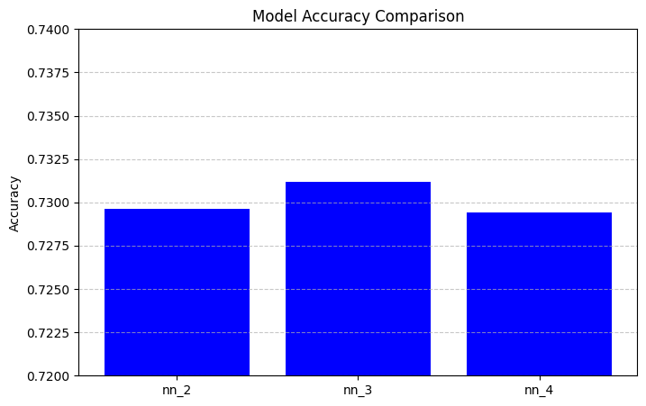

#  AlphabetSoup Charity Deep Learning Analysis

---

##  Overview

The goal of the analysis was to predict whether applicants to the charity would be successful in receiving funds. The prediction can help the organization prioritize applications more effectively

---

## Results

###  Data Preprocessing

- **Target Variable**:
  - The target variable that we were looking for, for whether a charity application was successful or not, was IS_SUCCESSFUL. 1-meaning it was a successful application or 0-meaning it wasn’t a successful application.
  

- **Feature Variables**:
  - All the other numerical and categorical columns in the dataset except for identifiers and labels were our feature variables.

- **Removed Variables**:
  - The EIN column should be removed, and the NAME column should be removed from the dataset

---

###  Compiling, Training, and Evaluating the Model

- For the model nn_2 I tried to slightly narrow the structure while maintaining the ReLU to test is reducing the neurons would improve the performance. In model nn_3 I added more neurons and hidden layers to see if it would have more success with a complex nonlinear pattern and in return would improve the performance. Lastly in nn_4 this tested whether Sigmoid activation in the hidden layers might improve the overall performance.

- I was not able to get the model up the 75% performance with the changes that I was making to the model

- I increased the depth and neuron count, tried multiple hidden layers, changed activation function and adjusted training epochs

---

##  Summary

---
The original model provided us with a very solid baseline with about 72% accuracy. Despite my multiple efforts to improve those results including increasing the number of hidden layers, adjusting neuron counts, and changing different activation functions, I was not able to significantly improve the performance of original model. These results indicate the dataset is limited more by the features than by the model itself. Meaning that the performance is likely due to characteristics of the data rather than the model itself. I think a model like Random Forest could be better for a dataset like this one. I would recommend that model because it is used with smaller structured data sets like this one. It could also be very useful against overfitting as well as which of the features in the data really matter. 

---

*Report prepared by: Natalie Annas*  
*Date: May 13, 2025*
